# RL Roboracer Platform: video script

14 slides in two parts, about 5.5 minutes of narration in total. Each slide is 1920×1080, with the on-screen text in the left third and the image in the right two thirds.

- **Part 1, user journeys (slides 00–08):** the lifecycle from `docs/images/user-journeys-pipeline.svg`, one slide per phase, then the Mad Scientist agent and the dashboard.
- **Part 2, architecture (slides 09–13):** the Docker Compose stack, one step of the control loop, MongoDB, storage, and day-to-day operations.

Every slide comes in two forms in this folder: `slide-NN-*` is the finished frame with the text laid out, and `image-NN-*` is the right-hand 1280×1080 image on its own. Both are SVG and PNG.

On the six phase slides (01–06) the current panel sits in the middle with its neighbours faded at the edges, so a slow pan between them reads as moving along the pipeline. The strip across the top shows where each slide sits in its part.

For a shorter cut, slides 00–08 stand alone as a user-journeys video of about 3.5 minutes, and 09–13 as a 2-minute architecture explainer.

## Part 1: user journeys

### Slide 00: From a Unity gym to a real robot car

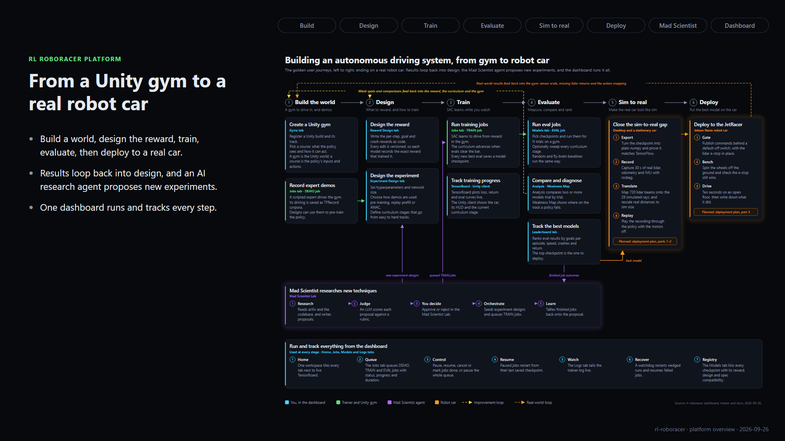

**On screen**

- Label: RL ROBORACER PLATFORM
- Headline: From a Unity gym to a real robot car
- Build a world, design the reward, train, evaluate, then deploy to a real car.
- Results loop back into design, and an AI research agent proposes new experiments.
- One dashboard runs and tracks every step.

**Narration**

> RL Roboracer is a platform for building self-driving policies, from a simulated Unity world all the way to a real robot car. This map shows the whole journey: build, design, train, evaluate, close the sim-to-real gap, and deploy. Results loop back into design, an AI research agent proposes new experiments, and one dashboard ties it all together.

*57 words, about 23 s.*

### Slide 01: Build the world

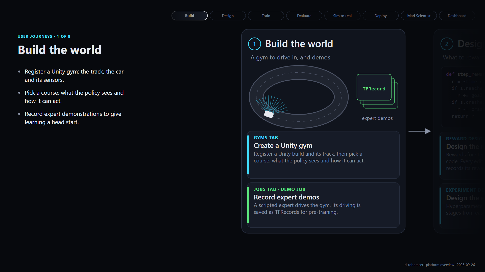

**On screen**

- Label: USER JOURNEYS · 1 OF 8
- Headline: Build the world
- Register a Unity gym: the track, the car and its sensors.
- Pick a course: what the policy sees and how it can act.
- Record expert demonstrations to give learning a head start.

**Narration**

> Everything starts with a world to drive in. You register a Unity build as a gym, and pick a course: what the policy observes and how it can act. A scripted expert can then drive the track, and its driving is saved as demonstrations the policy can learn from. Fifty-nine gym builds have been registered so far.

*57 words, about 23 s.*

### Slide 02: Decide what good driving means

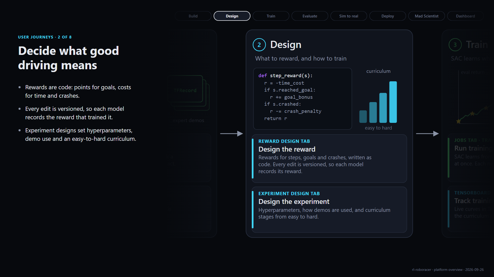

**On screen**

- Label: USER JOURNEYS · 2 OF 8
- Headline: Decide what good driving means
- Rewards are code: points for goals, costs for time and crashes.
- Every edit is versioned, so each model records the reward that trained it.
- Experiment designs set hyperparameters, demo use and an easy-to-hard curriculum.

**Narration**

> Next you decide what good driving means. Rewards are written as code: points for reaching goals, small costs for time, and penalties for crashing. Every edit is versioned, so each model remembers exactly which reward trained it. An experiment design then sets the hyperparameters, how demonstrations are used, and a curriculum that moves from easy tracks to hard ones.

*59 words, about 24 s.*

### Slide 03: Train with reinforcement learning

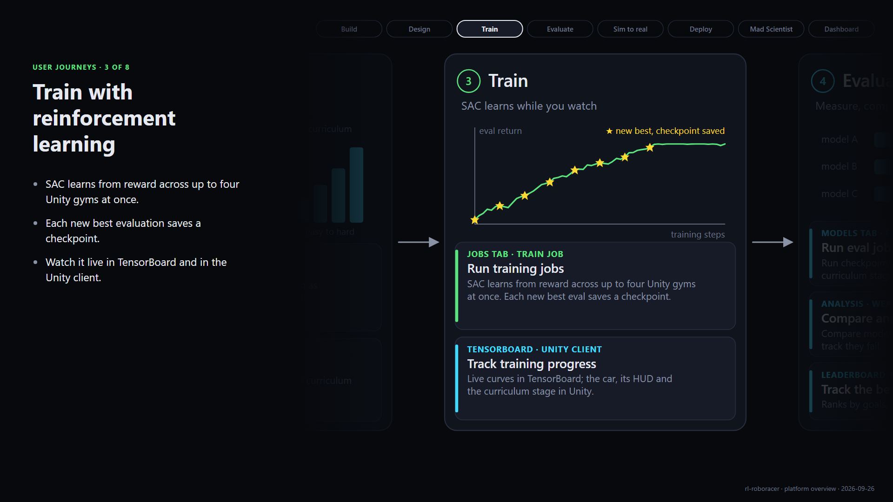

**On screen**

- Label: USER JOURNEYS · 3 OF 8
- Headline: Train with reinforcement learning
- SAC learns from reward across up to four Unity gyms at once.
- Each new best evaluation saves a checkpoint.
- Watch it live in TensorBoard and in the Unity client.

**Narration**

> Training jobs run Soft Actor-Critic, a reinforcement learning algorithm, across up to four Unity gyms in parallel. Every so often the trainer stops to evaluate, and each new best result is saved as a checkpoint. You can watch it happen live: learning curves in TensorBoard, and the car itself, with its HUD, in Unity.

*54 words, about 22 s.*

### Slide 04: Measure, compare, rank

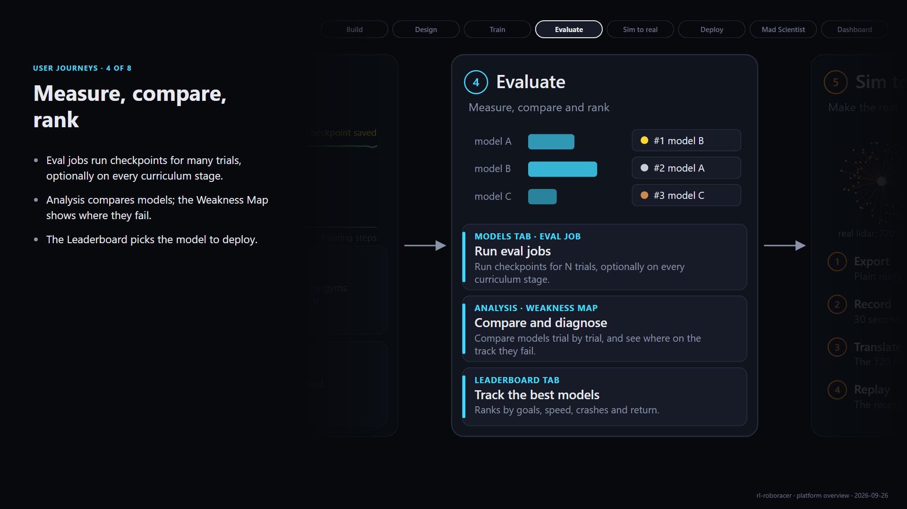

**On screen**

- Label: USER JOURNEYS · 4 OF 8
- Headline: Measure, compare, rank
- Eval jobs run checkpoints for many trials, optionally on every curriculum stage.
- Analysis compares models; the Weakness Map shows where they fail.
- The Leaderboard picks the model to deploy.

**Narration**

> Checkpoints then face evaluation jobs: many trials each, optionally across every stage of the curriculum. The Analysis tab compares models trial by trial, and the Weakness Map shows exactly where on the track a policy goes wrong. Those findings feed straight back into reward and curriculum design, and the Leaderboard picks the model worth deploying.

*55 words, about 22 s.*

### Slide 05: Make the real car look like the sim

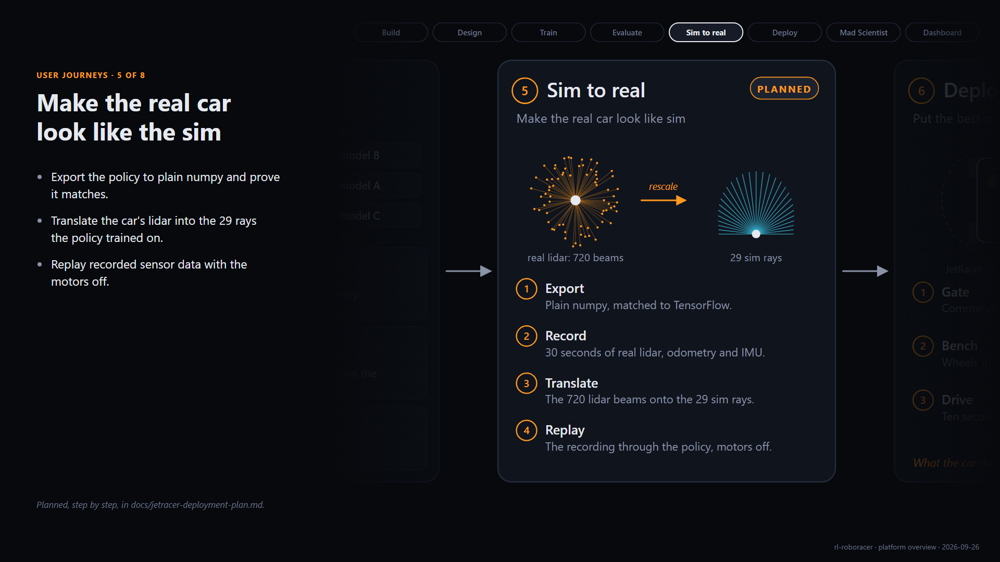

**On screen**

- Label: USER JOURNEYS · 5 OF 8
- Headline: Make the real car look like the sim
- Export the policy to plain numpy and prove it matches.
- Translate the car's lidar into the 29 rays the policy trained on.
- Replay recorded sensor data with the motors off.
- Footer: Planned, step by step, in docs/jetracer-deployment-plan.md.

**Narration**

> Before a policy touches real hardware, the real car has to look like the simulation. The policy is exported to plain numpy and checked against the original. The car's lidar, 720 beams, is translated into the 29 rays the policy knows, and rescaled to sim size. Then recorded sensor data is replayed through the policy with the motors off. This stage is planned and documented step by step.

*68 words, about 27 s.*

### Slide 06: Onto the JetRacer

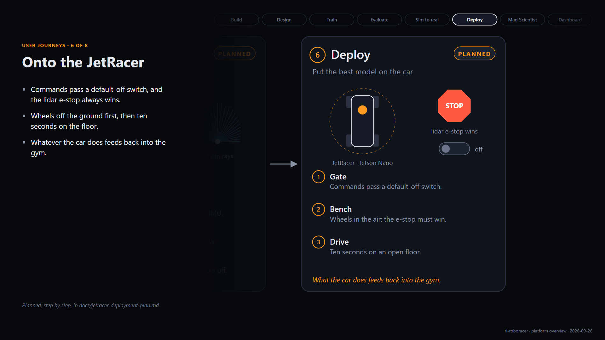

**On screen**

- Label: USER JOURNEYS · 6 OF 8
- Headline: Onto the JetRacer
- Commands pass a default-off switch, and the lidar e-stop always wins.
- Wheels off the ground first, then ten seconds on the floor.
- Whatever the car does feeds back into the gym.
- Footer: Planned, step by step, in docs/jetracer-deployment-plan.md.

**Narration**

> Then it's onto the JetRacer, a Jetson Nano robot car. Commands pass through a switch that defaults to off, and the lidar emergency stop always wins. First the wheels spin in the air, then ten seconds on an open floor. Whatever the car does, from sensor scale to missed lidar returns, feeds back into the gym for the next round.

*60 words, about 24 s.*

### Slide 07: An AI research agent

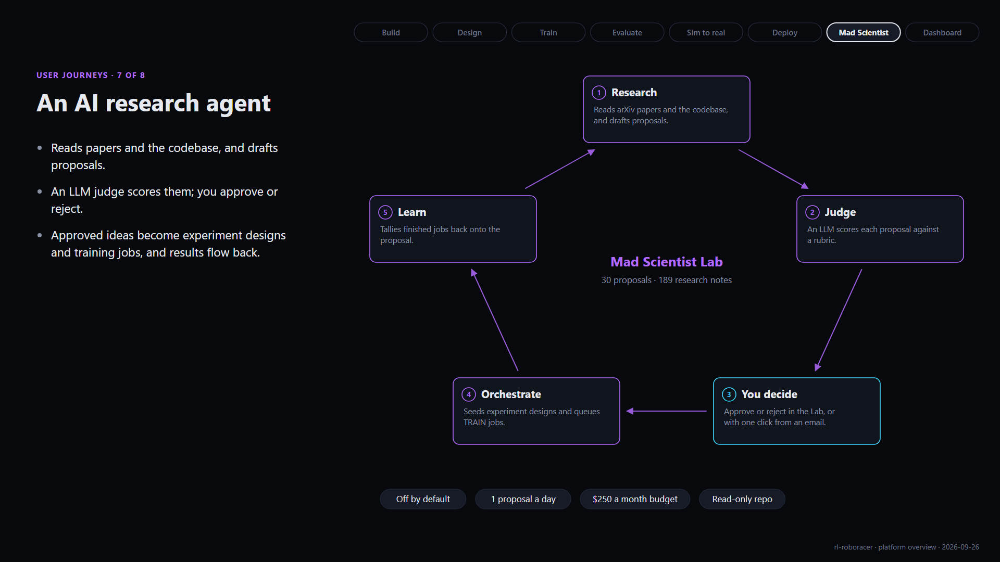

**On screen**

- Label: USER JOURNEYS · 7 OF 8
- Headline: An AI research agent
- Reads papers and the codebase, and drafts proposals.
- An LLM judge scores them; you approve or reject.
- Approved ideas become experiment designs and training jobs, and results flow back.

**Narration**

> Alongside you works the Mad Scientist, an AI research agent. It reads papers and the codebase, drafts proposals, and an LLM judge scores them against a rubric. You make the call, in the dashboard or with one click from an email. Approved ideas become experiment designs and training jobs, and the results are tallied back onto the proposal. It is off by default, with a daily cap and a monthly budget.

*71 words, about 28 s.*

### Slide 08: One dashboard for everything

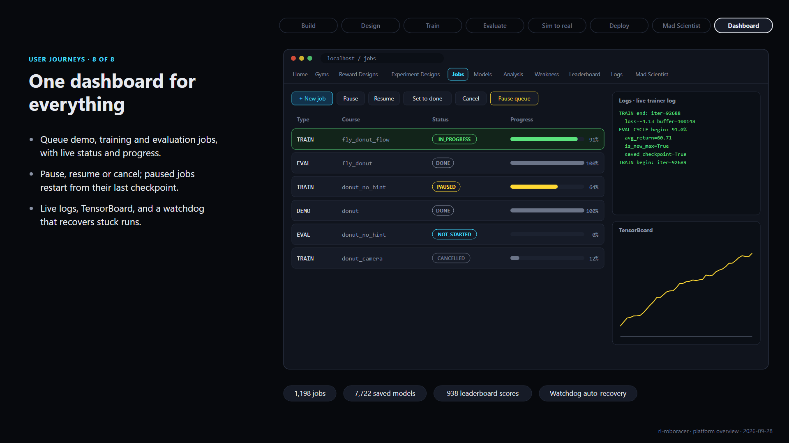

**On screen**

- Label: USER JOURNEYS · 8 OF 8
- Headline: One dashboard for everything
- Queue demo, training and evaluation jobs, with live status and progress.
- Pause, resume or cancel; paused jobs restart from their last checkpoint.
- Live logs, TensorBoard, and a watchdog that recovers stuck runs.

**Narration**

> All of this runs from one dashboard. The Jobs tab queues demo, training and evaluation jobs, and shows their status and progress. You can pause, resume or cancel, and a paused job picks up from its last checkpoint. Logs stream live, TensorBoard sits alongside, and a watchdog recovers stuck runs automatically. So far that's 1,194 jobs and 7,717 saved models.

*60 words, about 24 s.*

## Part 2: architecture

### Slide 09: How the pieces fit

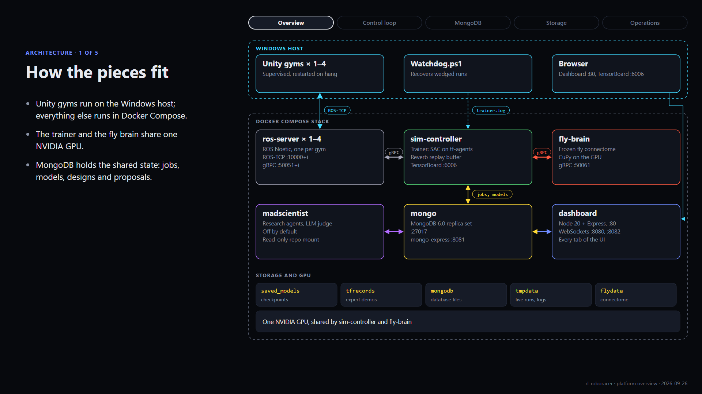

**On screen**

- Label: ARCHITECTURE · 1 OF 5
- Headline: How the pieces fit
- Unity gyms run on the Windows host; everything else runs in Docker Compose.
- The trainer and the fly brain share one NVIDIA GPU.
- MongoDB holds the shared state: jobs, models, designs and proposals.

**Narration**

> Under the hood, the Unity gyms run natively on a Windows host, and everything else runs as a Docker Compose stack. Each gym talks to its own ROS server. The sim-controller container holds the trainer, its replay buffer and TensorBoard, and shares the GPU with the fly-brain service. MongoDB holds the shared state, the dashboard sits on top, and the Mad Scientist agent runs beside it.

*66 words, about 26 s.*

### Slide 10: One step, ten times a second

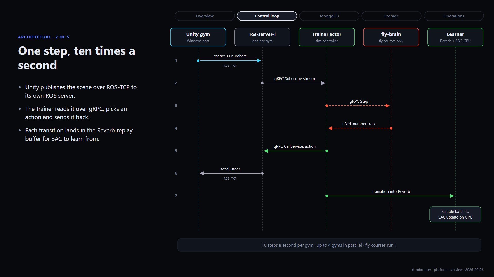

**On screen**

- Label: ARCHITECTURE · 2 OF 5
- Headline: One step, ten times a second
- Unity publishes the scene over ROS-TCP to its own ROS server.
- The trainer reads it over gRPC, picks an action and sends it back.
- Each transition lands in the Reverb replay buffer for SAC to learn from.

**Narration**

> Here's one step of the loop. Unity publishes what the car sees to its ROS server. The trainer streams that over gRPC, passes it through the fly brain on fly courses, picks an action, and calls back through the same ROS server to apply it. Each transition goes into a Reverb replay buffer, and the learner samples batches from it to train on the GPU. Ten times a second, per gym.

*71 words, about 28 s.*

### Slide 11: MongoDB is the shared memory

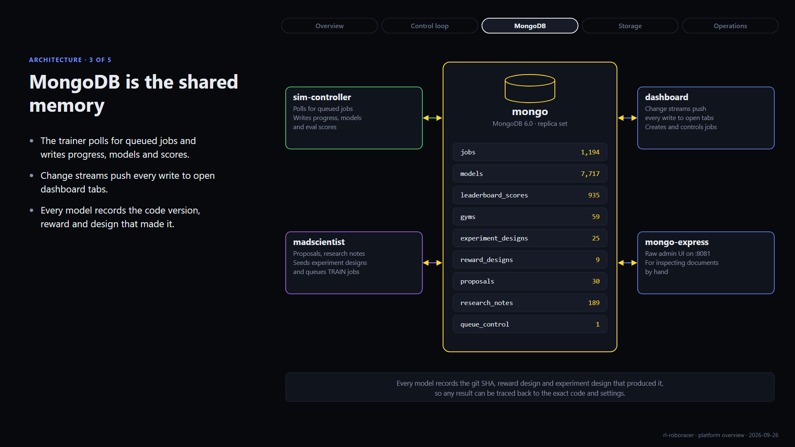

**On screen**

- Label: ARCHITECTURE · 3 OF 5
- Headline: MongoDB is the shared memory
- The trainer polls for queued jobs and writes progress, models and scores.
- Change streams push every write to open dashboard tabs.
- Every model records the code version, reward and design that made it.

**Narration**

> MongoDB is the platform's shared memory. The trainer polls it for queued jobs, and writes back progress, saved models and evaluation scores. It runs as a replica set, so change streams can push every write straight to open dashboard tabs. And every model records the code version, reward and experiment design that produced it, so any result can be traced back.

*61 words, about 24 s.*

### Slide 12: Where everything lives

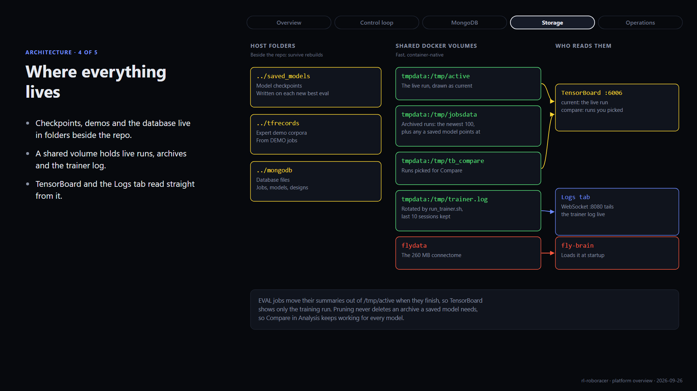

**On screen**

- Label: ARCHITECTURE · 4 OF 5
- Headline: Where everything lives
- Checkpoints, demos and the database live in folders beside the repo.
- A shared volume holds live runs, archives and the trainer log.
- TensorBoard and the Logs tab read straight from it.

**Narration**

> Checkpoints, demonstration data and the database files live in folders next to the repo, so they survive any container rebuild. A shared Docker volume holds the live run, archived runs and the trainer log. TensorBoard reads the live run plus any archived runs you pick to compare, and the dashboard's Logs tab streams the trainer log over a WebSocket.

*59 words, about 24 s.*

### Slide 13: Running the stack

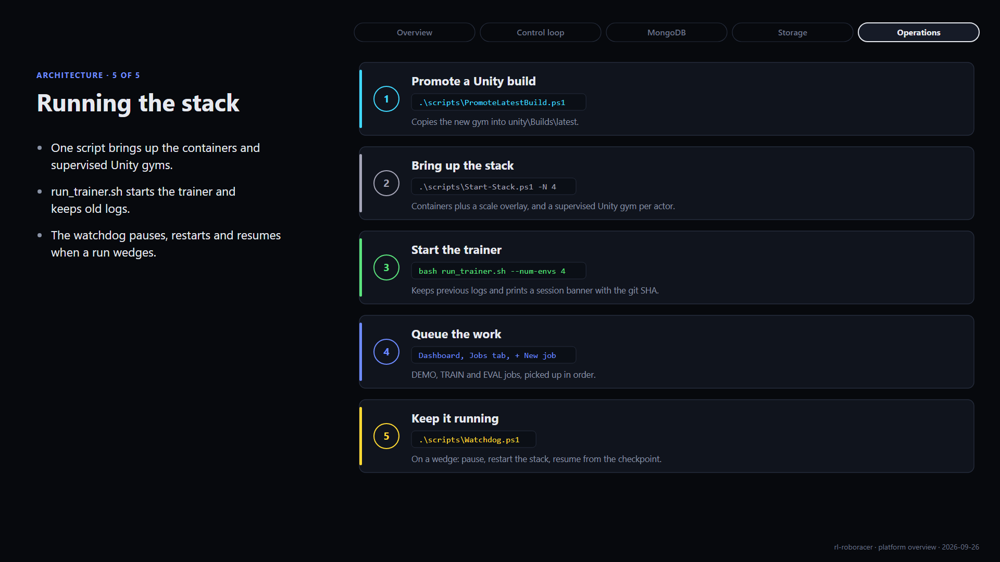

**On screen**

- Label: ARCHITECTURE · 5 OF 5
- Headline: Running the stack
- One script brings up the containers and supervised Unity gyms.
- run_trainer.sh starts the trainer and keeps old logs.
- The watchdog pauses, restarts and resumes when a run wedges.

**Narration**

> Operating it takes a handful of scripts. Promote a new Unity build, then Start-Stack brings up the containers and a supervised Unity gym per actor. run_trainer.sh launches the trainer and keeps every previous log. From there you queue work in the dashboard, and the watchdog keeps it running: if a run wedges, it pauses the job, restarts the stack and resumes from the checkpoint.

*64 words, about 26 s.*

## Where the facts come from

| Figure or claim | Source |
|---|---|
| Services, ports, volumes, GPU sharing | `docker-compose.yml`, `compose/scale.yml`, README service map |
| gRPC calls between trainer and ROS server | `protos/virtual_endpoint/proto/ros_service.proto` (`Subscribe`, `Publish`, `CallService`) |
| Collection counts (1,194 jobs, 7,717 models, 935 leaderboard scores, 59 gyms, 30 proposals, 189 research notes) | Live `robotaxi` database, read 2026-09-26 |
| Mad Scientist guardrails (off by default, 1 proposal a day, $250 a month) | `madscientist` service defaults in `docker-compose.yml` |
| Jobs tab buttons and columns | `dashboard/jobs.html` |
| Watchdog behaviour | `scripts/Watchdog.ps1` header |
| Log rotation, archive pruning, eval archiving | `rl_agent/run_trainer.sh`, `rl_agent/robotaxi.py`, README |
| Sim-to-real and deployment steps | `docs/jetracer-deployment-plan.md` (planned, not yet run on the car) |

The jobs shown in the dashboard mock-up on slide 08 are illustrative; the button labels, tabs and status names are the real ones.
